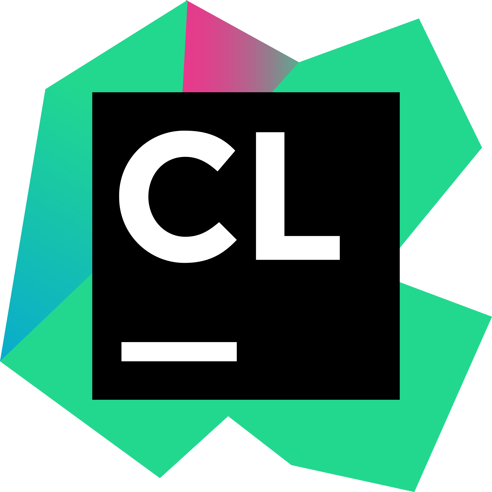
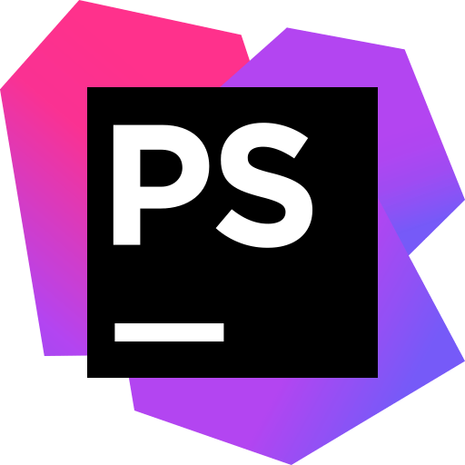

<h1 align="center">Hey Folks !  I'm Anuj</h1>
<h3 align="center">I'm an Aspiring Developer from </h3>

## 🙋‍♂️ Curious about Me ? 
 

- 👨🏻‍🎓 I’m an undergrad, learning Computer Science at **_[`PICT, Pune, India.`](https://pict.edu/about_us/)_** 

- 🔭 I’m currently learning **_`Foundation of User Experience`_**

- 👯 I’m looking to Contribute on open source **_`IoT Projects`_**

- 👨‍💻 All of my projects are available at **_[`Repositories`](https://github.com/AnujMutha?tab=repositories)_**

- ⚡ Fun fact **I'm an `Aspiring Programmer` and occasionally like `photography` 🎥📸**
 

## 🚀 Languages and Tools
 
<ul align="center">
<svg xmlns="http://www.w3.org/2000/svg" x="0px" y="0px"
width="48" height="48"
viewBox="0 0 48 48"
style=" fill:#000000;"><path fill="#ce4488" d="M23.019,23.75c-0.032,0-12.416-9.769-12.668-9.927L9.783,13.54c-1.828-0.693-3.845,0.252-4.538,2.08 c-0.599,1.607,0.063,3.372,1.45,4.223c0.221,0.126,0.41,0.221,0.63,0.284c0.126,0.063,14.307,5.925,14.307,5.925 c0.567,0.252,1.229,0.095,1.607-0.378C23.712,25.074,23.618,24.223,23.019,23.75z"></path><path fill="#ed3d7d" d="M5.024,17v-0.084C5.025,16.944,5.023,16.972,5.024,17z"></path><path fill="#ed3d7d" d="M7.024,19.981v-6.37l-0.455,0.307c-0.031,0.031-0.063,0.031-0.063,0.063H6.474 c-0.536,0.378-0.977,0.945-1.229,1.607c-0.166,0.437-0.233,0.887-0.221,1.328V17C5.087,18.261,5.841,19.419,7.024,19.981z"></path><path fill="#ed3d7d" d="M7.024,13.612v6.37c0.101,0.048,0.194,0.106,0.301,0.145c0.56,0.218,1.142,0.273,1.699,0.195 v-8.056L7.024,13.612z"></path><path fill="#ed427a" d="M9.024,12.265v8.056c0.571-0.08,1.115-0.301,1.578-0.636c0.164-0.117,0.293-0.245,0.422-0.375 v-8.392L9.024,12.265z"></path><path fill="#ed4479" d="M11.024,10.918v8.392c0.045-0.045,0.105-0.081,0.146-0.129l1.854-1.672V9.571L11.024,10.918z"></path><path fill="#fcee39" d="M12.455,41.177c-0.79,1.308-0.516,2.942,0.569,3.952v-4.65 C12.806,40.681,12.61,40.911,12.455,41.177z"></path><polygon fill="#ee4a75" points="15.024,8.225 13.024,9.571 13.024,17.509 15.024,15.705"></polygon><path fill="#fcee39" d="M13.937,39.885c-0.332,0.14-0.64,0.343-0.912,0.594v4.65c0.17,0.158,0.356,0.304,0.566,0.428 c0.452,0.266,0.942,0.401,1.434,0.43v-6.694L13.937,39.885z"></path><path fill="#fcee39" d="M15.024,39.294v6.694c0.676,0.039,1.354-0.128,1.937-0.493c0.018-0.018,0.041-0.03,0.063-0.045 v-7.244L15.024,39.294z"></path><polygon fill="#ee4c73" points="17.024,13.902 17.024,6.878 15.024,8.225 15.024,15.705"></polygon><path fill="#fce839" d="M17.024,38.206v7.244c0.054-0.036,0.113-0.068,0.158-0.113l1.842-1.284v-6.935L17.024,38.206z"></path><polygon fill="#ee5270" points="19.024,12.098 19.024,5.531 17.024,6.878 17.024,13.902"></polygon><polygon fill="#fbe146" points="19.024,37.118 19.024,44.053 21.024,42.658 21.024,36.031"></polygon><path fill="#ef566d" d="M20.629,10.652l0.396,0.337V5.05C20.874,5.021,20.72,5,20.561,5c-0.148,0-0.292,0.017-0.434,0.044 c-0.074,0.013-0.144,0.035-0.215,0.055c-0.063,0.018-0.126,0.036-0.188,0.059c-0.073,0.027-0.143,0.056-0.213,0.09 c-0.093,0.044-0.181,0.093-0.267,0.146c-0.018,0.012-0.038,0.021-0.056,0.034c-0.025,0.016-0.052,0.029-0.077,0.046l-0.087,0.059 v6.567L20.629,10.652z"></path><polygon fill="#fad93a" points="21.024,36.031 21.024,42.658 23.024,41.264 23.024,34.943"></polygon><path fill="#ef5d66" d="M23.024,12.694V6.44l-0.667-0.651c-0.106-0.113-0.222-0.216-0.349-0.308 c-0.007-0.005-0.014-0.012-0.021-0.017c-0.112-0.08-0.233-0.148-0.358-0.208c-0.026-0.013-0.05-0.03-0.078-0.042 c-0.114-0.05-0.234-0.086-0.356-0.119c-0.042-0.011-0.081-0.029-0.123-0.038c-0.016-0.003-0.033-0.002-0.048-0.005v5.939 L23.024,12.694z"></path><polygon fill="#f06063" points="25.024,14.399 25.024,8.393 23.024,6.44 23.024,12.694"></polygon><polygon fill="#f9ce3a" points="23.024,34.943 23.024,41.264 25.024,39.87 25.024,33.855"></polygon><polygon fill="#f0635f" points="27.024,16.104 27.024,10.347 25.024,8.393 25.024,14.399"></polygon><polygon fill="#f8c03b" points="25.024,33.855 25.024,39.87 27.024,38.475 27.024,32.767"></polygon><polygon fill="#f1655c" points="29.024,17.81 29.024,12.301 27.024,10.347 27.024,16.104"></polygon><polygon fill="#f7b33b" points="27.024,32.767 27.024,38.475 29.024,37.081 29.024,31.68"></polygon><polygon fill="#f16956" points="31.024,19.515 31.024,14.255 29.024,12.301 29.024,17.81"></polygon><polygon fill="#f6a53c" points="29.024,31.68 29.024,37.081 31.024,35.686 31.024,30.592"></polygon><polygon fill="#f26c51" points="33.024,21.22 33.024,16.209 31.024,14.255 31.024,19.515"></polygon><polygon fill="#f5983c" points="31.024,30.592 31.024,35.686 33.024,34.292 33.024,29.504"></polygon><polygon fill="#f48a3c" points="33.024,29.504 33.024,34.292 35.024,32.898 35.024,28.417"></polygon><polygon fill="#f2704d" points="35.024,22.925 35.024,18.163 33.024,16.209 33.024,21.22"></polygon><polygon fill="#f27249" points="37.024,24.63 37.024,20.117 35.024,18.163 35.024,22.925"></polygon><polygon fill="#f07b33" points="35.024,28.417 35.024,32.898 37.024,31.503 37.024,27.329"></polygon><polygon fill="#f37644" points="37.024,20.117 37.024,24.63 38.957,26.278 37.024,27.329 37.024,31.503 39.024,30.109 39.024,22.07"></polygon><polygon fill="#f37841" points="39.024,30.109 41.024,28.714 41.024,24.024 39.024,22.07"></polygon><path fill="#f37b3d" d="M41.952,28.068c0.108-0.081,0.368-0.272,0.482-0.386c0.312-0.249,0.524-0.622,0.557-1.063 c0-0.41-0.158-0.819-0.441-1.103l-1.526-1.491v4.69L41.952,28.068z"></path><path fill="#424242" d="M16,17h16v16H16V17z"></path><path fill="#fff" d="M17.315,30.003h6.019V31h-6.019V30.003z M17.252,21.009l0.473-0.441 c0.126,0.158,0.252,0.252,0.41,0.252c0.189,0,0.284-0.126,0.284-0.378v-1.67h0.725v1.67c0,0.315-0.095,0.567-0.252,0.725 c-0.158,0.158-0.41,0.252-0.725,0.252C17.693,21.45,17.441,21.261,17.252,21.009z M19.3,18.803h2.111v0.599h-1.387v0.41h1.261 v0.567h-1.261v0.41h1.418v0.63h-2.111L19.3,18.803z M22.357,19.433h-0.788v-0.63h2.3v0.63h-0.788v1.985h-0.725V19.433z M17.315,22.017h1.355c0.315,0,0.567,0.095,0.725,0.221c0.095,0.095,0.158,0.252,0.158,0.441c0,0.315-0.158,0.473-0.41,0.599 c0.315,0.095,0.504,0.284,0.504,0.63c0,0.441-0.378,0.725-0.977,0.725h-1.355V22.017z M18.828,22.837 c0-0.158-0.126-0.221-0.315-0.221H18.04v0.473h0.441C18.702,23.057,18.828,22.994,18.828,22.837z M18.576,23.593h-0.567v0.473 h0.567c0.221,0,0.347-0.095,0.347-0.252S18.796,23.593,18.576,23.593z M19.773,22.017h1.229c0.41,0,0.662,0.095,0.851,0.284 c0.158,0.158,0.221,0.347,0.221,0.599c0,0.41-0.221,0.662-0.536,0.819l0.63,0.914h-0.819l-0.536-0.788h-0.315v0.788h-0.725V22.017z M20.971,23.278c0.252,0,0.378-0.126,0.378-0.315c0-0.221-0.158-0.315-0.378-0.315h-0.473v0.63H20.971z"></path><path fill="#fff" d="M22.924,22.017h0.693l1.103,2.647h-0.788l-0.189-0.473h-1.008l-0.189,0.473H21.79L22.924,22.017z M23.555,23.593l-0.284-0.725l-0.284,0.725H23.555z M24.815,22.017h0.725v2.616h-0.725V22.017z M25.729,22.017h0.662l1.071,1.387 v-1.387h0.725v2.616h-0.63l-1.103-1.418v1.45h-0.725V22.017z M28.25,24.255l0.41-0.473c0.252,0.221,0.536,0.315,0.851,0.315 c0.189,0,0.315-0.063,0.315-0.189s-0.095-0.158-0.441-0.252c-0.567-0.126-0.977-0.284-0.977-0.819c0-0.473,0.378-0.851,1.008-0.851 c0.441,0,0.788,0.126,1.071,0.347l-0.378,0.504c-0.252-0.158-0.504-0.252-0.725-0.252c-0.189,0-0.252,0.063-0.252,0.158 c0,0.126,0.095,0.158,0.441,0.252c0.599,0.126,0.977,0.315,0.977,0.819c0,0.536-0.41,0.851-1.071,0.851 C29.006,24.696,28.565,24.538,28.25,24.255z"></path></svg>
  
  
  
  
  
  
  
  
  

  
  
  
  
  
  
  
  
  
  
  
</ul>
 
<h2 align="start">Statistics 📊</h2>

     

<h2 align="start">Languages Used <></h2>

        

 
<h2 align="center">💬 Connect with me</h2>
<ul align="center">
   
  

</ul>
 
<h5 align="center">(click on the images to visit the webpage, images may not display on mobile phones)</h5>